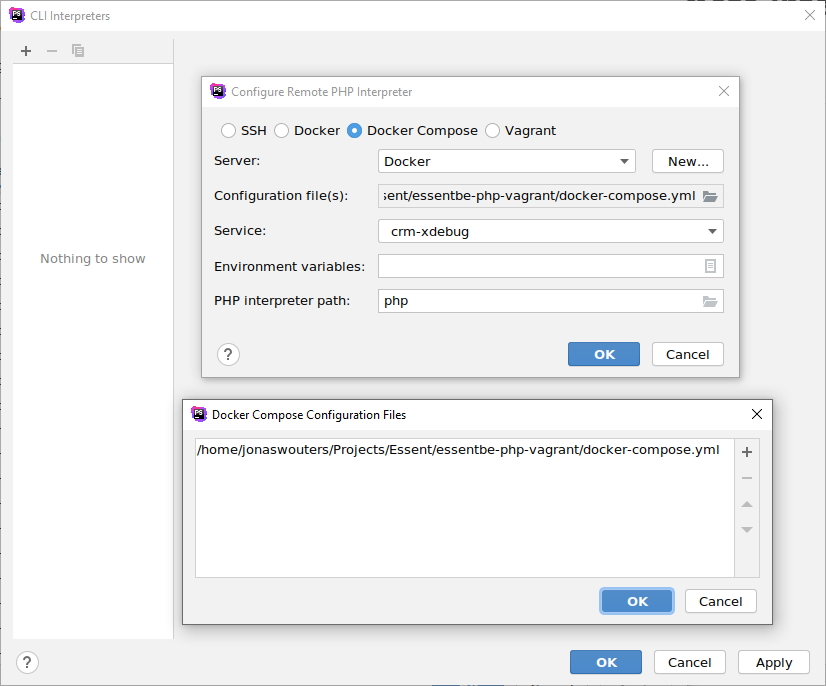
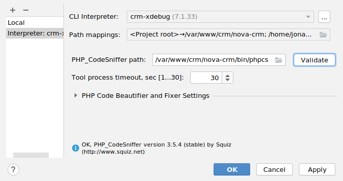

[Back to index](../index.md)

# Docker with PHPStorm 

## Remote interpreter

**Languages & Frameworks -> PHP**

Add a new **CLI Interpreter -> From Docker, Vagrant, ...**

Make sure you select **Docker Compose** and point to the `docker-compose.yml` file in the vagrant repository.
The list of services will show up in the dropdown after that.

## PHPCS

**Languages & Frameworks -> PHP -> Quality Tools: PHP_CodeSniffer**

Add a new configuration for the remote interpreter by clicking **...**

### Enable inspection

**Editor -> Inspections**

Enable **PHP -> Quality tools -> PHP_CodeSniffer Validation**

**Coding standard: custom** 
`/var/www/crm/nova-crm/config/phpcs.docker.xml` 

(create the file `phpcs.docker.xml` with the correct path prefix `/var/www/crm/nova-crm` when using it this way)

## Codeception

**Languages & Frameworks -> PHP -> Test Frameworks**

Add a new **Codeception by Remote Interpreter**

All the settings should be automatically detected.